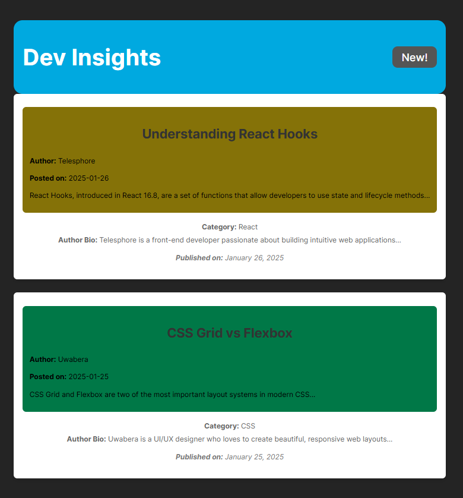

# Dev Insights Blog

## Overview

The **Dev Insights Blog** is a simple blog application built with **React** and **TypeScript**. This project serves as a platform to display blog posts on various web development topics, such as React and CSS. It demonstrates the use of React functional components, TypeScript for type safety, and styling using a combination of CSS methods.

## Screenshot

Here’s a screenshot of the application:



## Technologies Used

- **React** (Frontend Framework)
- **TypeScript** (Static Typing for JavaScript)
- **Vite** (Next-generation frontend tool for fast development)
- **CSS** (Styling)

## Installation and Running

To get started with the Dev Insights Blog application:

### 1. Clone the Repository

```bash
git clone https://github.com/Telesphore-Uwabera/Mini-Blog.git
cd mini-blog
```

### 2. Install Dependencies

Make sure you have [Node.js](https://nodejs.org/) installed. Then run the following command to install the necessary dependencies:

```bash
npm install
```

### 3. Run the Development Server

Once the dependencies are installed, you can run the app in development mode:

```bash
npm run dev
```

The app will be available at [http://localhost:3000](http://localhost:3000).

### 4. Run Tests

If you have any tests (unit tests, etc.), you can run them using:

```bash
npm run test
```

Note: As of now, no automated tests are included in this project.

## Features

- Displays blog posts with the option to filter by "New!" to show posts published in the last 24 hours.
- Each post displays the title, author bio, content preview, and the publication date.
- The blog uses modern React features like hooks (`useState`, `useEffect`).

## Component Choices (Functional vs Class)

In this project, I decided to use **functional components** over **class components**. Here are the reasons:

1. **Simplicity**: Functional components are simpler to write and understand, especially when using hooks. There's no need to manage lifecycle methods or `this` bindings.
2. **Hooks**: The React hooks API provides a cleaner, more modular approach to managing state and side effects in functional components.
3. **Performance**: Functional components are generally faster than class components since they don’t carry the overhead of instance methods and lifecycle methods. 

I used the `React.FC` type for functional components, ensuring that the components accept props and children where necessary.

## Styling Choices

I decided to use **CSS** for styling in this project. Here's a breakdown:

- **External CSS**: For global styles and layout, I used external CSS files. This approach keeps the styling separate from the component logic, making it easier to manage and scale the project.
- **Conditional Styling**: For the "New!" badge in the header, I used CSS classes to conditionally apply styles based on whether the post was published within 24 hours. This was implemented via a filter in the `PostList` component.
- **No CSS-in-JS**: I chose not to use libraries like `styled-components` or CSS-in-JS because the project’s scope didn’t require complex dynamic styling and I wanted to keep things simple for now.

## Optimization Strategies

1. **Memoization**: Used `React.memo` for the `Post` component to avoid unnecessary re-renders.
2. **Efficient Date Calculation**: Used `Date` objects to check if a post was published in the last 24 hours, which is efficient for the filtering process.

## Challenges & Solutions

### 1. Handling Post Filters Based on Date

Initially, I had trouble filtering posts based on the date of publication. I resolved this by converting the post date and current date into timestamps and comparing them to determine whether the post was published in the last 24 hours. This was efficient and clean.

### 2. Passing State Between Components

Passing the `showNewPosts` state between components (like `App.tsx` and `PostList.tsx`) was a bit tricky initially. However, I managed to use React's `useState` hook and passed the state as props to ensure seamless communication between components.

## External Libraries/Packages Used

- **React**: The main frontend library.
- **TypeScript**: For type safety and better code quality.
- **Vite**: A fast, next-generation build tool that significantly improves development speed.

## Future Improvements

- **Add Routing**: Implement client-side routing using `react-router-dom` to support different pages, such as individual post pages.
- **Add Testing**: Implement unit and integration tests using tools like Jest and React Testing Library.
- **Deployment**: Deploy the app to a platform like Vercel or Netlify for production.
